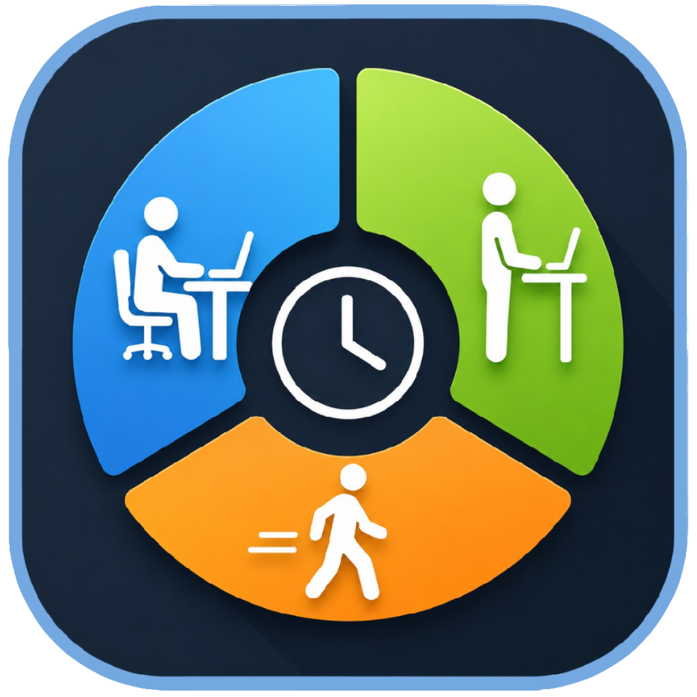

# Kinetics: Cornell Protocol Productivity Timer

> A customizable productivity timer Chrome Extension that enforces the Cornell 20-8-2 ergonomic posture protocol using in-browser modal notifications and audible chimes. Built with Manifest V3.

## Features

- **The Cornell Protocol**: Enforces the scientifically-backed 20-8-2 method (20 mins sitting, 8 mins standing, 2 mins moving) to reduce physical fatigue and improve focus.
- **Customizable Durations**: Adjust sit, stand, and move times to fit your workflow via the settings panel.
- **Strict In-Browser Modals**: Full-page overlay notifications that require acknowledgment — no easily ignored system alerts.
- **Audible Chimes**: Pleasant double-tone alert plays alongside the visual notification.
- **Keyboard & Click Dismiss**: Press Enter/Escape or click outside the modal to dismiss.
- **Sleek Interface**: Dark-mode design with gradients, tabular-nums countdowns, and a responsive layout.
- **Privacy First**: All data (session times, statistics) is stored locally using `chrome.storage.local`. No external tracking, no cloud databases.
- **Manifest V3 Compliant**: Built on Chrome's latest extension architecture, utilizing background Service Workers and `chrome.alarms` for efficient background processing.

## Installation (Developer Mode)

1. Clone or download this repository to your local machine.
2. Open Google Chrome and navigate to `chrome://extensions/`.
3. Toggle on **Developer mode** in the top right corner.
4. Click **Load unpacked** in the top left.
5. Select the `Kinetics` folder containing this extension's code.
6. Pin the extension to your toolbar and click "Start Day" to begin!

## Usage

1. Click **Start Day** to begin tracking.
2. Click **Start Session** to start a 3-cycle Cornell protocol session (sit -> stand -> move x3).
3. A modal overlay with an audible chime will appear at each transition — acknowledge it to continue.
4. Click **End Day** to stop and view your day summary.
5. Use the settings gear icon to customize sit/stand/move durations.

## Technical Architecture

- `manifest.json`: V3 architecture with permissions for `alarms`, `storage`, `scripting`, `activeTab`, and `host_permissions` for tab injection.
- `background.js`: Service worker that manages the state machine, posture transitions via `chrome.alarms`, and dynamic content script injection.
- `content.js` / `content.css`: Handles the full-page modal overlay with fade animation, chime audio, and keyboard/click dismissal.
- `popup.html` / `popup.js`: The popup UI with session controls, countdown timers, day summary stats, and settings panel.
- `fallback.html`: Dedicated notification page used when no injectable tab is available.

## Built With

- Vanilla JavaScript
- HTML5
- Modern CSS3 (Inter font, Flexbox, CSS Variables)
- Chrome Extensions API (MV3)

## Author

**RubarMo**
- [GitHub: @RubarMo](https://github.com/RubarMo)

If you find this extension helpful for your productivity and posture, feel free to give the repository a star!

## License

This project is open-source and available under the [MIT License](LICENSE).
